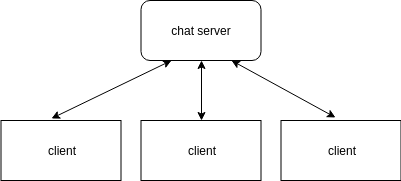

<!-- TOC -->

- [说明](#说明)

<!-- /TOC -->

# 说明
参考
* https://www.boost.org/doc/libs/1_55_0/doc/html/boost_asio/examples/cpp11_examples.html (boost proactor参考)

其实主要问题还是和hub的一致的,程序需要维护一个连接池,锁的粒度是,`增加`,`删除`,`遍历发送`.其中`遍历发送`这一步可能会由于单客户端的阻塞发送,而影响整体的吞吐.

解决方法就是`拷贝`,但是随之带来的问题是消息堆积,始终发不出去,服务端内存暴涨.

所以猜想是应该是在内存中堆积到一定程度后,`持久化`到磁盘中.

我目前不会做那么复杂的,暂且只做成阻塞发送的吧!

