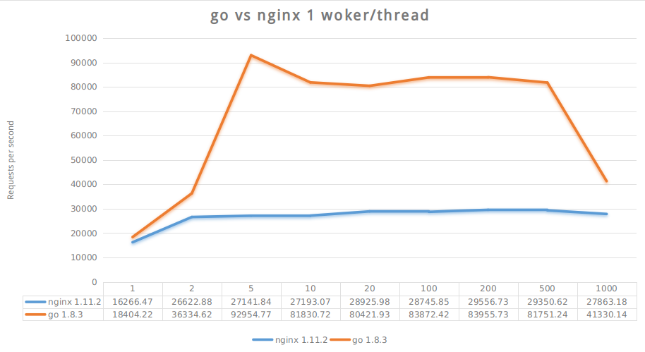

<!-- TOC -->

- [1. 说明](#1-说明)

<!-- /TOC -->

<a id="markdown-1-说明" name="1-说明"></a>
# 1. 说明

很奇怪,nginx只能占用`50%`的cpu,而go是`100%`


安装echo模块
```bash
# nginx echo模块的安装
wget 'http://nginx.org/download/nginx-1.11.2.tar.gz'
tar -xzvf nginx-1.11.2.tar.gz

# echo模块
wget https://github.com/openresty/echo-nginx-module/archive/v0.61.tar.gz
tar -xvzf archive/v0.61.tar.gz

cd nginx-1.11.2/
./configure --add-module=/media/yq/ST1000DM003/linux/package/echo-nginx-module-0.61

sudo make -j2
sudo make install

```

nginx bench
```bash
cd nginx

# 测试文件
sudo /usr/local/nginx/sbin/nginx -t -c /home/yq/go/src/github.com/yqsy/recipes/http_bench/nginx/nginx.conf

# 跑起来
sudo /usr/local/nginx/sbin/nginx -c /home/yq/go/src/github.com/yqsy/recipes/http_bench/nginx/nginx.conf


# ab
# -n number of requests to perform for the benchmarking session. The default is to just perform a single request which usually leads to non-representative benchmarking results.
# -k keeplive
# -r Don't exit on socket receive errors.
# -c Number of multiple requests to perform at a time. Default is one request at a time.

taskset -c 1 sudo /usr/local/nginx/sbin/nginx -c /home/yq/go/src/github.com/yqsy/recipes/http_bench/nginx/nginx.conf

reqNum=100000
for clientNum in 1 2 5 10 20 50 100 200 500 1000; do
    ab -n $reqNum -k -r -c $clientNum 127.0.0.1:20001/hello
    sleep 3
done

```

go bench
```bash
cd go
go build server.go

reqNum=100000
for clientNum in 1 2 5 10 20 50 100 200 500 1000; do
    taskset -c 1 ./server :20001 & srvpid=$!
    sleep 3
    ab -n $reqNum -k -r -c $clientNum 127.0.0.1:20001/hello
    kill -9 $srvpid
    sleep 3
done

```