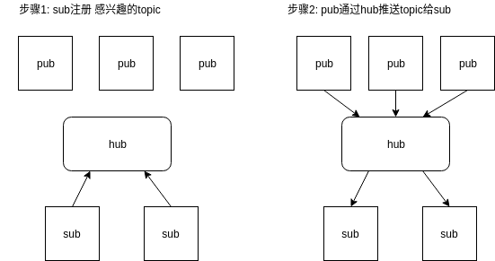

<!-- TOC -->

- [1. 说明](#1-说明)
- [2. 问题](#2-问题)
    - [2.1. 如何维护sub池,锁该怎么正确使用,消息在一个sub堵住怎么办?](#21-如何维护sub池锁该怎么正确使用消息在一个sub堵住怎么办)

<!-- /TOC -->


<a id="markdown-1-说明" name="1-说明"></a>
# 1. 说明



支持指令：
```
sub <topic>\r\n
unsub <topic>\r\n
pub <topic>\r\n<content>\r\n
```

<a id="markdown-2-问题" name="2-问题"></a>
# 2. 问题


<a id="markdown-21-如何维护sub池锁该怎么正确使用消息在一个sub堵住怎么办" name="21-如何维护sub池锁该怎么正确使用消息在一个sub堵住怎么办"></a>
## 2.1. 如何维护sub池,锁该怎么正确使用,消息在一个sub堵住怎么办?

这个问题比较难

我暂时想到的三个方案:

* read pub 加锁 -> 发给所有的 sub -> 解锁 (问题:中间过程中其他pub无法把消息推送给相同的topic,`sub单点接收慢影响整体吞吐`)
* read pub 加锁 -> copy给所有的sub应用层发送缓冲区(每个sub event loop发送) -> 解锁  (问题:虽然copy可以大量的节省时间,解决第一个问题,并且应该可以大幅度提升并行效率.但是`消息堆积内存,内存暴涨`)
* 在上面的基础上,加上应用层确认机制,如果消息有积压的趋势,持久化到磁盘中.`待研究市面上的消息队列的做法`

我暂时只实现第一种,因为比较简单(稍后学习的消息队列应该会有科学的做法)

