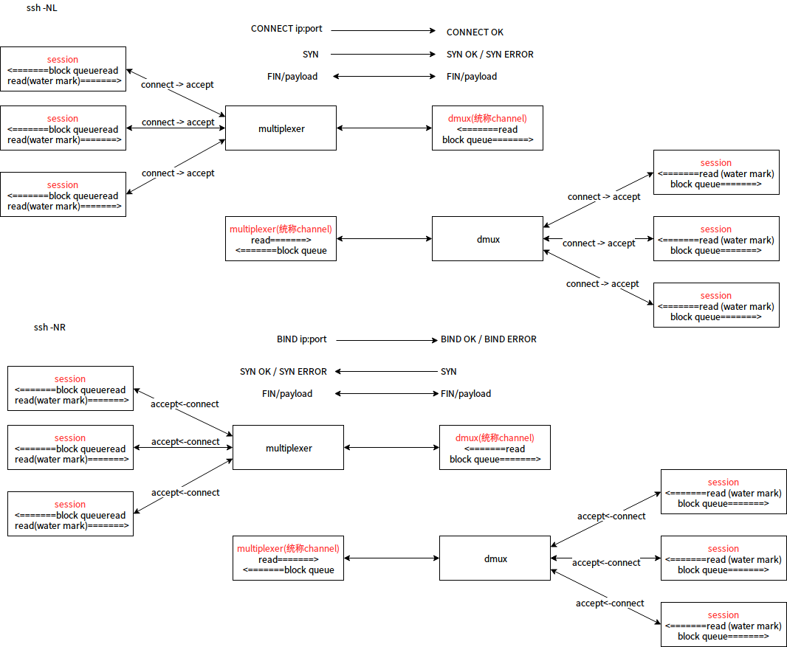

<!-- TOC -->

- [1. multiplexer dmux](#1-multiplexer-dmux)
- [2. 包头定义](#2-包头定义)

<!-- /TOC -->


<a id="markdown-1-multiplexer-dmux" name="1-multiplexer-dmux"></a>
# 1. multiplexer dmux

```
session ======>|-------------|          |------|======> session
session ======>| multiplexer |=========>| dmux |======> session
session ======>|-------------|          |------|======> session
```

这个项目比简单的proxy增加了一些难度(multiplexer维护一个客户端连接/dmux维护一组连接)




`ssh -NL`功能切入的思考点如下:  
* multiplexer发送`CONNECT ip:port`给dmux握手,握手成功后本地开始监听接受session
* session发送`seq`,`fin`,`payload`给multiplexer然后包装给dmux


<a id="markdown-2-包头定义" name="2-包头定义"></a>
# 2. 包头定义

* len 4 byte
* id 4 byte
* cmd 1 byte (bool)
* if cmd == true, command

---

建立channel握手:
* CONNECT ip:port
* CONNECT OK
* BIND ip:port
* BIND OK
---

其他:
* FIN
* ACK xxx // xxx is bytes num
* SYN
* SYN OK
* SYN ERROR

