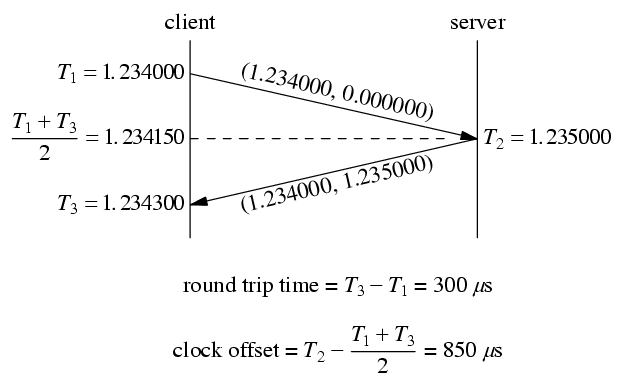

<!-- TOC -->

- [1. 说明](#1-说明)
- [2. 精简版本](#2-精简版本)

<!-- /TOC -->

# 1. 说明

参考
* https://en.wikipedia.org/wiki/Network_Time_Protocol

roundtrip时间公式:  

clock offset:  
((T0 + T3) - (T1 + T2))/2

# 2. 精简版本

