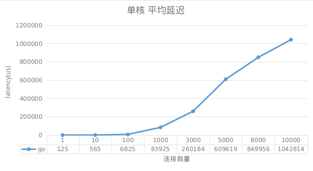
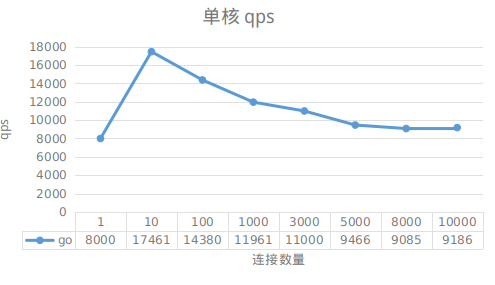

<!-- TOC -->

- [1. 选择](#1-选择)
- [2. 测量](#2-测量)
- [3. 测量维度](#3-测量维度)
    - [3.1. 客户端测量维度](#31-客户端测量维度)
    - [3.2. 服务端测量维度](#32-服务端测量维度)
- [4. 命令](#4-命令)

<!-- /TOC -->


<a id="markdown-1-选择" name="1-选择"></a>
# 1. 选择

陈硕的实例有5种模型

模型|特点|优缺点
-|-|-
server_basic.cc|单eventloop|发挥单核性能
server_threadpool.cc|单eventloop,线程池|发挥多核性能,不过延时会增加一些
server_multiloop.cc|多eventloop|发挥多核性能,延时不增加
server_hybrid.cc|动态eventloop,线程池|处理带宽单event loop应付不过来的情况
server_prod.cc|过载保护|1. 队列太大,返回server too busy 2.发送缓冲区水位

这5种模型我统统都不实验^ - ^. 我的选择是用go来做实验.

主要有几点考虑:
* 并发模型的不同,不需要去思考`(单/多)`event loop 以及线程池
* 不需要去思考过载保护,因为数据积压在了内核缓冲区

大大的减少了心智负担.

<a id="markdown-2-测量" name="2-测量"></a>
# 2. 测量


陈硕的测量方式有5种

文件|说明
-|-
batch.cc|直接求解
batch.cc|通过网络求解,得到网络占比
pipeline.cc|测量最大容量,流水线深度多少时把服务器cpu占满
sudoku_stress.cc|压力测试
loadtest.cc|性能测试,延迟,最小,最大,平均,中位数, 延迟分布


<a id="markdown-3-测量维度" name="3-测量维度"></a>
# 3. 测量维度


<a id="markdown-31-客户端测量维度" name="31-客户端测量维度"></a>
## 3.1. 客户端测量维度

* min
* max
* sum
* average
* median
* p90
* p99


<a id="markdown-32-服务端测量维度" name="32-服务端测量维度"></a>
## 3.2. 服务端测量维度

延迟维度

描述|变量名
-|-
延迟累加|latency_sum_us
60秒内每秒延迟|latency_sum_us_per_second 
60秒内总计延迟|latency_sum_us_60s


请求维度

描述|变量名
-|-
请求累加|total_requests/total_responses/total_solved/bad_requests/dropped_requests
60秒内每秒请求|requests_per_second
60秒内总计请求|requests_60s
平均延迟|latency_us_60s_avg / latency_us_avg


<a id="markdown-4-命令" name="4-命令"></a>
# 4. 命令


直接求解和通过网络求解的对比

```bash
# 网络服务
go run sudokuserver.go :20000 > /dev/null 2>&1

ab -n 100000 -c 1 -k http://localhost:20000/sudoku/080001030500804706000270000920400003103958402400002089000029000305106008040300010

# 直接测试
go run direct_solve.go 100000 080001030500804706000270000920400003103958402400002089000029000305106008040300010
```

直接测试|网络测试
-|-
1s|11s

客户端延时测试,观察在请求量大的时候`用户平均请求等待时间`是否会上升

* https://segmentfault.com/q/1010000008852127/a-1020000008855812 (ab的计算公式)
```bash
mkdir -p bin

cd sudokuserver
go build sudokuserver.go
mv sudokuserver ../bin

cd ../sudokuloadtest
go build sudokuloadtest.go
mv sudokuloadtest ../bin
cd ../bin


problem=080001030500804706000270000920400003103958402400002089000029000305106008040300010
dest=127.0.0.1:20000 
host=:20000

for connections in 1 10 100 1000 3000 5000 8000 10000; do
    for qps in 10000; do
        taskset -c 1 ./sudokuserver  $host > /dev/null 2>&1 & serverpid=$!
        sleep 2
        ./sudokuloadtest $dest $qps $connections $problem & clientpid=$!
        sleep 5
        kill -9 $serverpid $clientpid
        sleep 3
    done
done
```


客户端角度的延迟会大大的下降



nginx负载均衡测试,是否能水平扩展   
结论:单机上面不容易测试,下次有机会多机器测试!  

```bash
sudo mv  /etc/nginx/nginx.conf /etc/nginx/nginx.conf.bak
sudo cp ./nginx.conf /etc/nginx/nginx.conf
sudo nginx

problem=080001030500804706000270000920400003103958402400002089000029000305106008040300010
dest=127.0.0.1:20000 
host=:20000

for connections in 1 10 100 1000 3000 5000 8000 10000; do
    for qps in 10000; do
        taskset -c 1 ./sudokuserver :20001 > /dev/null 2>&1 & serverpid1=$!
        taskset -c 2 ./sudokuserver :20002 > /dev/null 2>&1 & serverpid2=$!
        taskset -c 3 ./sudokuserver :20003 > /dev/null 2>&1 & serverpid3=$!
        taskset -c 4 ./sudokuserver :20004 > /dev/null 2>&1 & serverpid4=$!
        sleep 2
        ./sudokuloadtest $dest $qps $connections $problem & clientpid=$!
        sleep 5
        kill -9 $clientpid $serverpid1 $serverpid2 $serverpid3 $serverpid4
        sleep 3
    done
done
```

生成直方图
```
gnuplot
plot 'r0003' using 1:2 with boxes
```
